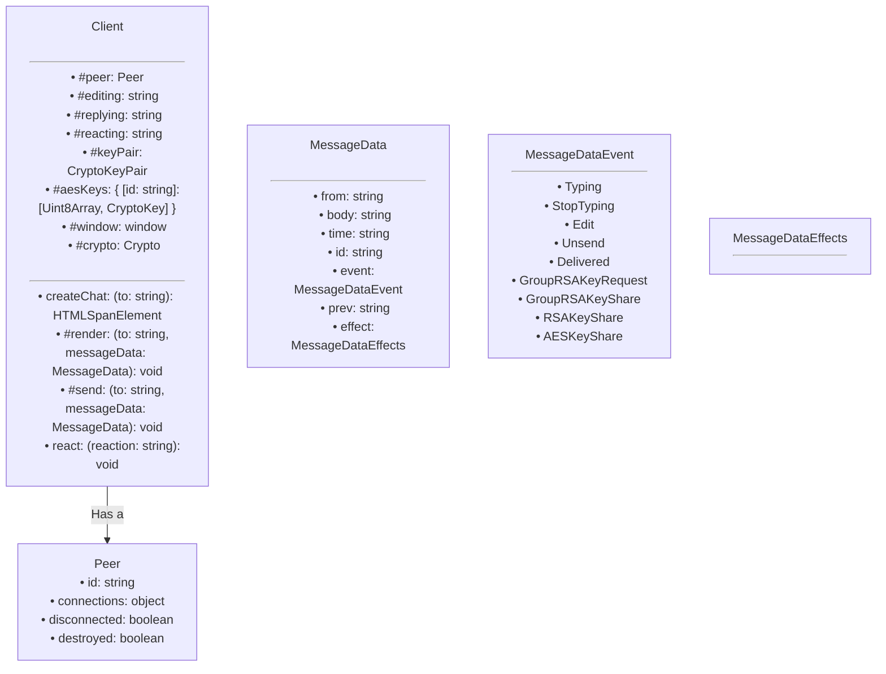
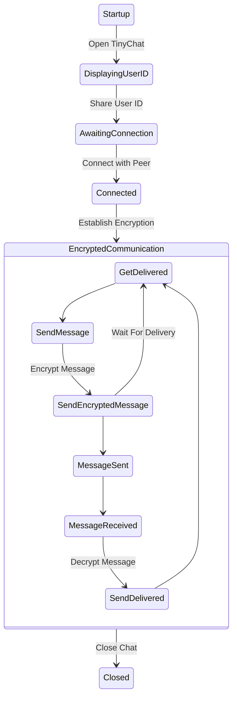
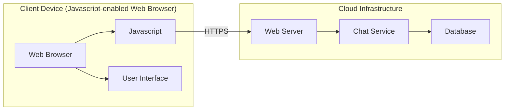
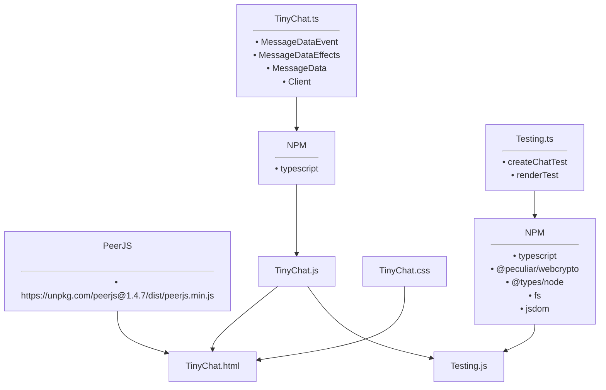
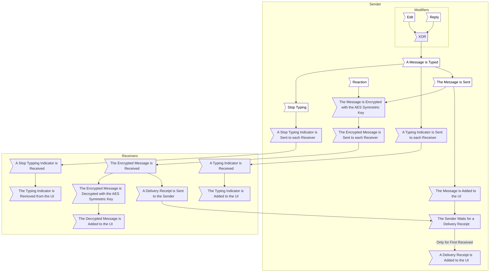

# 4+1 Diagram

## Logical View

```mermaid
graph TB;
  A["
  Client
    <hr>#8226; #peer: Peer
    #8226; #editing: string
    #8226; #replying: string
    #8226; #reacting: string
    #8226; #keyPair: CryptoKeyPair
    #8226; #aesKeys: { [id: string]: [Uint8Array, CryptoKey] }
    #8226; #window: window
    #8226; #crypto: Crypto
    <hr>#8226; createChat: (to: string): HTMLSpanElement
    #8226; #render: (to: string, messageData: MessageData): void
    #8226; #send: (to: string, messageData: MessageData): void
    #8226; react: (reaction: string): void
  "] --> |Has a| B["
  Peer
    #8226; id: string
    #8226; connections: object
	#8226; disconnected: boolean
	#8226; destroyed: boolean
  "];
  C["
  MessageData
    <hr>#8226; from: string
    #8226; body: string
    #8226; time: string
    #8226; id: string
    #8226; event: MessageDataEvent
    #8226; prev: string
    #8226; effect: MessageDataEffects
  "];
  D["
  MessageDataEvent
    <hr>#8226; Typing
    #8226; StopTyping
    #8226; Edit
    #8226; Unsend
    #8226; Delivered
    #8226; GroupRSAKeyRequest
    #8226; GroupRSAKeyShare
    #8226; RSAKeyShare
    #8226; AESKeyShare
  "];
  E["
  MessageDataEffects
  <hr>
  "];
```

## Process View

```mermaid
stateDiagram
    Startup --> DisplayingUserID: Open TinyChat
    DisplayingUserID --> AwaitingConnection: Share User ID
    AwaitingConnection --> Connected: Connect with Peer
    Connected --> EncryptedCommunication: Establish Encryption
    EncryptedCommunication --> Closed: Close Chat
    state EncryptedCommunication {
        GetDelivered --> SendMessage
        SendMessage --> SendEncryptedMessage: Encrypt Message
        SendEncryptedMessage --> GetDelivered: Wait For Delivery
        SendEncryptedMessage --> MessageSent
        MessageSent --> MessageReceived
        MessageReceived --> SendDelivered: Decrypt Message
        SendDelivered --> GetDelivered
    }
```

## Physical View

```mermaid
graph LR
  subgraph Client_Device["Client Device (Javascript-enabled Web Browser)"]
    Browser[Web Browser] --> JS[Javascript];
    Browser --> UI[User Interface];
  end
  subgraph Cloud_Infrastructure["Cloud Infrastructure"]
    JS -->|HTTPS| WebServer;
    WebServer[Web Server] --> ChatService[Chat Service]
    ChatService --> DB[Database]
  end
```

## Development View

```mermaid
graph TB
  A["TinyChat.html"];
  B["
  PeerJS
    <hr>#8226; https://unpkg.com/peerjs@1.4.7/dist/peerjs.min.js
  "] --> A;
  C["TinyChat.js"] --> A;
  D["
  NPM
    <hr>#8226; typescript
  "] --> C;
  E["
  TinyChat.ts
    <hr>#8226; MessageDataEvent
    #8226; MessageDataEffects
    #8226; MessageData
    #8226; Client
  "] --> D;
  F["TinyChat.css"] --> A;
  G["Testing.js"];
  H["
  NPM
    <hr>#8226; typescript
    #8226; @peculiar/webcrypto
    #8226; @types/node
    #8226; fs
    #8226; jsdom
  "] --> G;
  C --> G;
  I["
  Testing.ts
  <hr>#8226; createChatTest
  #8226; renderTest
  "] --> H;
```

## Scenarios View

```mermaid
graph TB;
  subgraph "Sender"
    subgraph "Modifiers"
      P>Edit] --> O;
      Q>Reply] --> O;
    end
    O>XOR] --> A;
    A>A Message is Typed];
    A --> S>Stop Typing];
    S --> T>A Stop Typing Indicator is Sent to each Receiver];
    A --> B>A Typing Indicator is Sent to each Receiver];
    A --> E>The Message is Sent];
    E --> F>The Message is Encrypted with the AES Symmetric Key];
    R>Reaction] --> F;
    F --> G>The Encrypted Message is Sent to each Receiver];
    E --> L>The Message is Added to the UI];
    L --> M>The Sender Waits for a Delivery Receipt];
    M --> |Only for First Received| N>A Delivery Receipt is Added to the UI];
  end
  subgraph "Receivers"
    B --> C>A Typing Indicator is Received];
    C --> D>The Typing Indicator is Added to the UI];
    G --> H>The Encrypted Message is Received];
    H --> I>The Encrypted Message is Decrypted with the AES Symmetric Key];
    I --> J>The Decrypted Message is Added to the UI];
    H --> K>A Delivery Receipt is Sent to the Sender];
    K --> M;
    T --> U>A Stop Typping Indicator is Received];
    U --> V>The Typing Indicator is Removed from the UI];
  end

  classDef user fill:#fff,color:#000
  class A,E,P,Q,R,S user;
```
