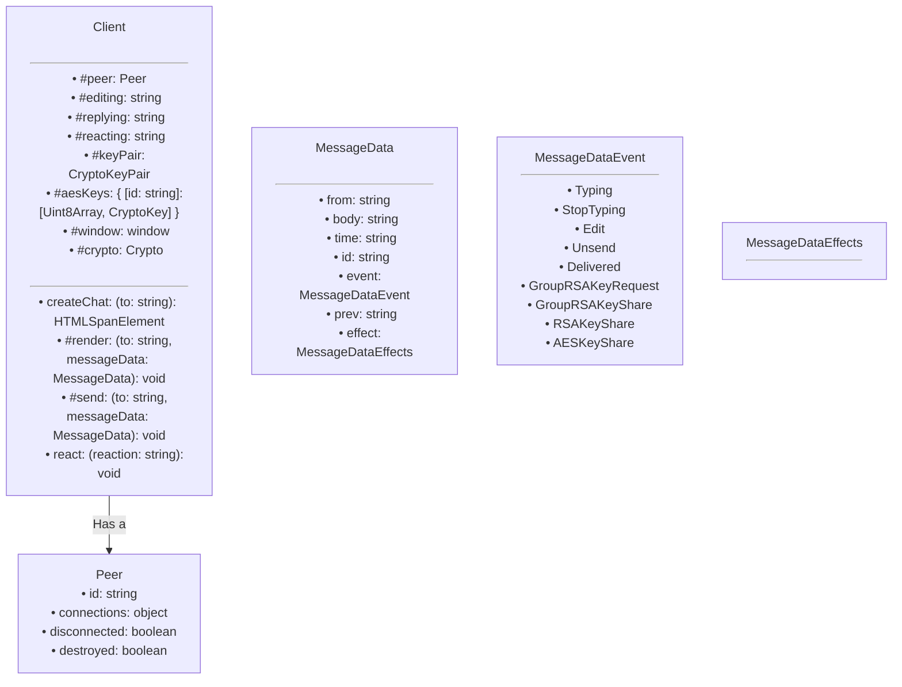
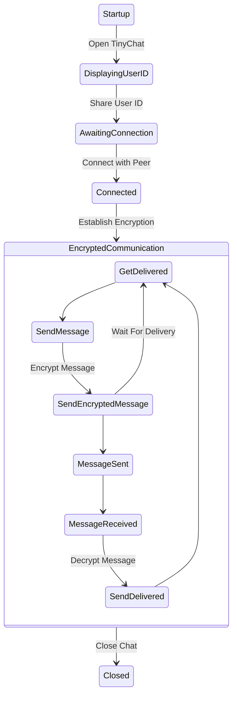

# 4+1 Diagram

## Logical View

```mermaid
graph TB;
  A["
  Client
    <hr>#8226; #peer: Peer
    #8226; #editing: string
    #8226; #replying: string
    #8226; #reacting: string
    #8226; #keyPair: CryptoKeyPair
    #8226; #aesKeys: { [id: string]: [Uint8Array, CryptoKey] }
    #8226; #window: window
    #8226; #crypto: Crypto
    <hr>#8226; createChat: (to: string): HTMLSpanElement
    #8226; #render: (to: string, messageData: MessageData): void
    #8226; #send: (to: string, messageData: MessageData): void
    #8226; react: (reaction: string): void
  "] --> |Has a| B["
  Peer
    #8226; id: string
    #8226; connections: object
	#8226; disconnected: boolean
	#8226; destroyed: boolean
  "];
  C["
  MessageData
    <hr>#8226; from: string
    #8226; body: string
    #8226; time: string
    #8226; id: string
    #8226; event: MessageDataEvent
    #8226; prev: string
    #8226; effect: MessageDataEffects
  "];
  D["
  MessageDataEvent
    <hr>#8226; Typing
    #8226; StopTyping
    #8226; Edit
    #8226; Unsend
    #8226; Delivered
    #8226; GroupRSAKeyRequest
    #8226; GroupRSAKeyShare
    #8226; RSAKeyShare
    #8226; AESKeyShare
  "];
  E["
  MessageDataEffects
  <hr>
  "];
```

## Process View

```mermaid
stateDiagram
    Startup --> DisplayingUserID: Open TinyChat
    DisplayingUserID --> AwaitingConnection: Share User ID
    AwaitingConnection --> Connected: Connect with Peer
    Connected --> EncryptedCommunication: Establish Encryption
    EncryptedCommunication --> Closed: Close Chat
    state EncryptedCommunication {
        GetDelivered --> SendMessage
        SendMessage --> SendEncryptedMessage: Encrypt Message
        SendEncryptedMessage --> GetDelivered: Wait For Delivery
        SendEncryptedMessage --> MessageSent
        MessageSent --> MessageReceived
        MessageReceived --> SendDelivered: Decrypt Message
        SendDelivered --> GetDelivered
    }
```
