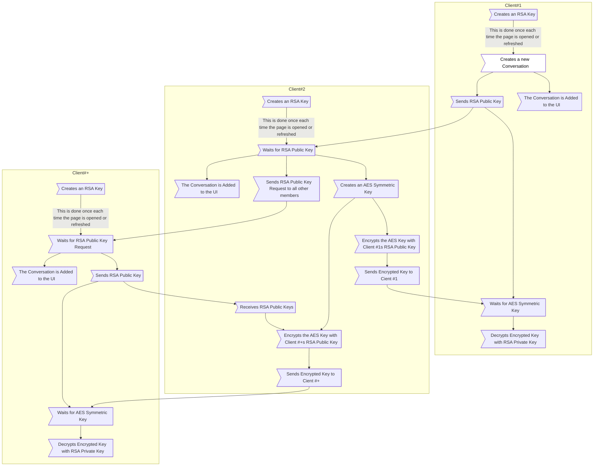
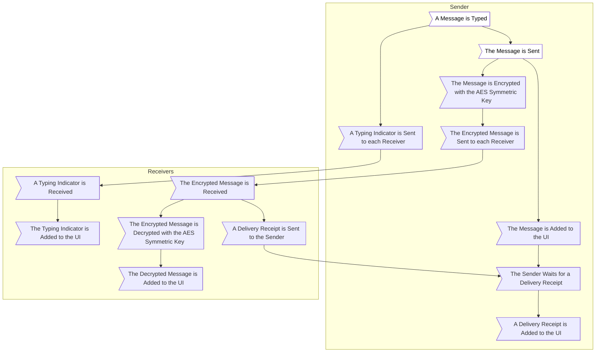

# TinyChat

> [!NOTE]
> Although this project is usable in the ways described below, this is *not* complete and progress can be seen [here](#features) as well as planned improvements for the future.

TinyChat works through the usage of [PeerJS](https://peerjs.com/).
When you open a TinyChat web page, a User ID will be shown in the top right bar.
This User ID is how people can contact you, but this will change every time you refresh the page.
TinyChat aims to give end-to-end encrypted communication through RSA-OAEP and AES-CBC encryption.
Each conversation will have a unique AES-256 key with that key being shared using your RSA public key to allow the peer to produce a key that only the sender knows prior to encryption and that only you can decrypt as it will be encrypted with your RSA public key.

> [!WARNING]
> Although the messages themselves are encrypted, many other metadata items are not.
> Further explanation of how this is done can be seen [here](#mermaid-diagram).
>
> What the attacker *cannot* read:
>
> - The message body
> - The time the message was sent
> - The message ID being replied to (should the message be a reply)
> - The effect being applied to the message (confetti, spotlight, etc.)
>
> What the attacker *can* read:
>
> - The User ID that sent the message
> - The message ID (This is a randomly generated GUID)
> - The message event type (message, delivery receipt, typing indicator, message edit, etc.)

## Features

- [x] ~~Sending Messages~~
  - [x] ~~Backend~~
    - [x] ~~Create Conversation Groups with Client ID~~
    - [x] ~~Create Conversations~~
    - [x] ~~Create Messages~~
    - [x] ~~Send Messages~~
    - [x] ~~Receive Messages~~
  - [x] ~~Frontend~~
    - [x] ~~Create Conversation UI~~
    - [x] ~~Create Message UI~~
    - [x] ~~View Message History~~
- [x] ~~Themes (Light/Dark)~~
  - [x] ~~Frontend~~
    - [x] ~~Light Theme~~
    - [x] ~~Dark Theme~~
- [x] ~~Delivery Receipts~~
  - [x] ~~Backend~~
    - [x] ~~Send Delivery Receipts~~
    - [x] ~~Receive Delivery Receipts~~
  - [x] ~~Frontend~~
    - [x] ~~Show Delivery Receipts in UI~~
- [x] ~~Typing Indicators~~
  - [x] ~~Backend~~
    - [x] ~~Handle Typing Logic~~
    - [x] ~~Send Typing Indication~~
    - [x] ~~Receive Typing Indication~~
  - [x] ~~Frontend~~
    - [x] ~~Show Typing Indicators in UI~~
- [x] ~~Editing Messages~~
  - [x] ~~Backend~~
    - [x] ~~Send Edited Messages~~
    - [x] ~~Receive Edited Messages~~
  - [x] ~~Frontend~~
    - [x] ~~Edit Message UI~~
    - [x] ~~Edited Message Indication in UI~~
- [x] ~~End-To-End Encrypted~~
  - [x] ~~Backend~~
    - [x] ~~Establish RSA Keys~~
      - [x] ~~Public~~
      - [x] ~~Private~~
    - [x] ~~Share AES Key Encrypted with RSA~~
    - [x] ~~Send Encrypted Messages~~
- [x] ~~Replies~~
  - [x] ~~Backend~~
    - [x] ~~Create Replies~~
    - [x] ~~Send Replies~~
  - [x] ~~Frontend~~
    - [x] ~~Create Replies~~
    - [x] ~~Reply Indication in UI~~
- [ ] Effects
  - [ ] Backend
    - [ ] Create Effects
    - [ ] Send Effects
  - [ ] Frontend
    - [ ] Create Effects
    - [ ] Reaction Indication in UI
- [ ] Unsend/Delete
  - [ ] Backend
    - [ ] Create Deletion Request
    - [ ] Handle Deletion Request for Sender
    - [ ] Handle Deletion Request for Receiver
  - [ ] Frontend
    - [ ] Create Deletion Request
    - [ ] Delete Message from Sender
    - [ ] Delete Message from Receiver
- [ ] Reactions
  - [ ] Backend
    - [ ] Create Reactions
    - [ ] Send Reactions
  - [ ] Frontend
    - [ ] Create Reactions
    - [ ] Reaction Indication in UI

## Mermaid Diagram

Below shows the process of 2+ clients intiating a conversation.
`Client#1` is the client initiating the conversation, `Client#2` is the first client listed in the sender box, and `Client#+` are any clients after.
As you can see from the graph, the processes the users perform themselves are quite minimal allowing for an overall easy-to-use messaging client.
Additionally, because everything is end-to-end encrypted, the server holding the data will never know your message contents.
The reasoning behind `Client#2` doing much of the key-generation and key-sharing is to prevent the malicious creation of a conversation.
Since one of the recipients is responsible for generating much of the encryption data, `Client#1` is incapable of creating conversations with invalid keys.

Further, below shows the process of a message being sent in a group conversation.
As much of the security has already been established, there is no need to put as much processing on any client in particular and the distribution of the workload can be kept to where it is exclusively necessary.
Because of this, all `Receivers` have the same processes and the `Sender` is the one responsible for ensuring security of their own message (although this is done on the backend meaning the actual user has to do nothing with it).
A `delivery receipt` is only processed once to ensure that the message is being sent to any client and are no longer processed after the first is received.

