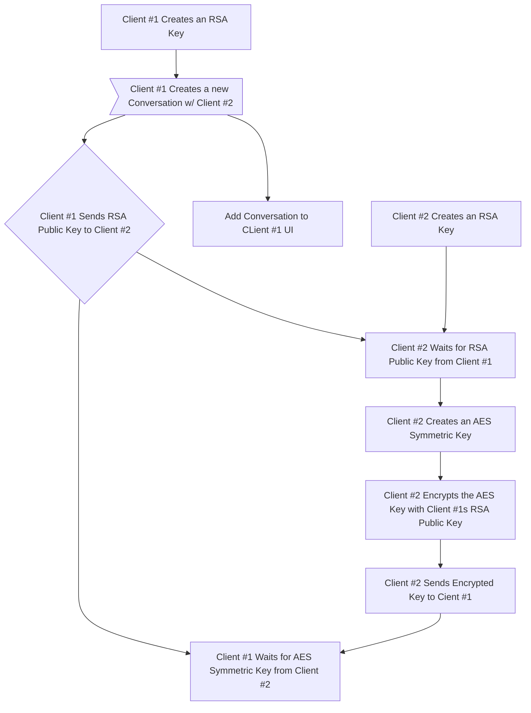

# TinyChat

## Features

Features

- [x] Sending Messages
  - [x] Backend
    - [x] Create Conversation Groups with Client ID
    - [x] Create Conversations
    - [x] Create Messages
    - [x] Send Messages
    - [x] Receive Messages
  - [x] Frontend
    - [x] Create Conversation UI
    - [x] Create Message UI
    - [x] View Message History
- [x] Themes (Light/Dark)
  - [x] Frontend
    - [x] Light Theme
    - [x] Dark Theme
- [x] Delivery Receipts
  - [x] Backend
    - [x] Send Delivery Receipts
    - [x] Receive Delivery Receipts
  - [x] Frontend
    - [x] Show Delivery Receipts in UI
- [x] Typing Indicators
  - [x] Backend
    - [x] Handle Typing Logic
    - [x] Send Typing Indication
    - [x] Receive Typing Indication
  - [x] Frontend
    - [x] Show Typing Indicators in UI
- [x] Editing Messages
  - [x] Backend
    - [x] Send Edited Messages
    - [x] Receive Edited Messages
  - [x] Frontend
    - [x] Edit Message UI
    - [x] Edited Message Indication in UI
- [x] End-To-End Encrypted
  - [x] Backend
    - [x] Establish RSA Keys
      - [x] Public
      - [x] Private
    - [x] Share AES Key Encrypted with RSA
    - [x] Send Encrypted Messages
- [ ] Replies
  - [x] Backend
    - [x] Create Replies
    - [x] Send Replies
  - [ ] Frontend
    - [x] Create Replies
    - [ ] Reply Indication in UI
- [ ] Reactions
  - [ ] Backend
    - [ ] Create Reactions
    - [ ] Send Reactions
  - [ ] Frontend
    - [ ] Create Reaction
    - [ ] Reaction Indication in UI

## Mermaid Diagram

Mermaid Diagram

  K --> L[Client #1 Decrypts Encrypted Key with RSA Private Key];
  L --> |The following could be either client, but Client #1 will be the sender for this example| M>A Message is Typed by Client #1 and Sent to Client #2];
  M --> N[The message is Encrypted with the AES Symmetric Key Established];
  N --> O[The Encrypted Message is Sent to Client #2];
  M --> Q[The Message is Added to the Conversation Screen for Client #1];
  Q --> R[Client #1 Waits for Delivery Receipt from Client #1];
  R --> V[A Delivery Indicator is Added to the Conversation Screen];
  O --> P[Client #2 Receives the message];
  P --> S[Client #2 Decrypts the Message];
  S --> T[The Message is Added to the Conversation Screen for Client #2];
  P --> U[Client #2 Sends a Delivery Receipts to Client #1];
  U --> R;

