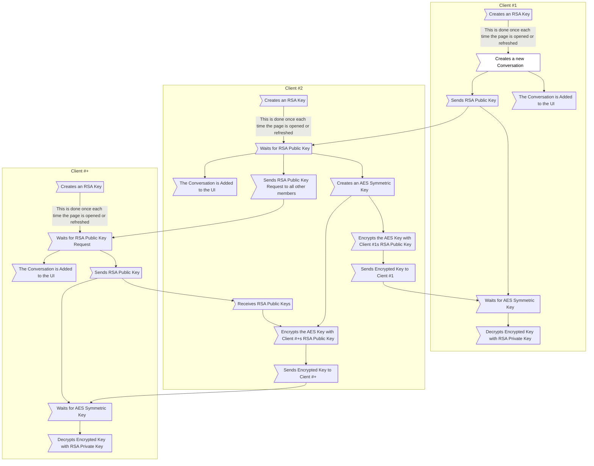

# TinyChat

> [!NOTE]
> Although this project is usable in the ways described below, this is *not* complete and progress can be seen [here](#features) as well as planned improvements for the future.

TinyChat works through the usage of [PeerJS](https://peerjs.com/).
When you open a TinyChat web page, a User ID will be shown in the top right bar.
This User ID is how people can contact you, but this will change every time you refresh the page.
TinyChat aims to give end-to-end encrypted communication through RSA-OAEP and AES-CBC encryption.
Each conversation will have a unique AES-256 key with that key being shared using your RSA public key to allow the peer to produce a key that only the sender knows prior to encryption and that only you can decrypt as it will be encrypted with your RSA public key.

> [!IMPORTANT]
> Although the messages themselves are encrypted, many other metadata items are not.
> Further explanation of how this is done can be seen [here](#mermaid-diagram).
>
> What the attacker *cannot* read:
>
> - The message body
> - The time the message was sent
> - The message ID being replied to (should the message be a reply)
> - The effect being applied to the message (confetti, spotlight, etc.)
>
> What the attacker *can* read:
>
> - The User ID that sent the message
> - The message ID (This is a randomly generated GUID)
> - The message event type (message, delivery receipt, typing indicator, message edit, etc.)

> [!WARNING]
> The largest vulnerability to this web application is the initial AES keyshare.
> On slower network connections, an attack can theoretically read the public RSA key and send a malicious AES key with a fake signature.
> This attack would be undetectable as it classifies as a "Man in the Middle Attack".
> Although this would be quite difficult to achieve in general usage, it is theoretically possible and worth consideration.

## Features

- [x] ~~Sending Messages~~
  - [x] ~~Backend~~
    - [x] ~~Create Conversation Groups with Client ID~~
    - [x] ~~Create Conversations~~
    - [x] ~~Create Messages~~
    - [x] ~~Send Messages~~
    - [x] ~~Receive Messages~~
  - [x] ~~Frontend~~
    - [x] ~~Create Conversation UI~~
    - [x] ~~Create Message UI~~
    - [x] ~~View Message History~~
- [x] ~~Themes (Light/Dark)~~
  - [x] ~~Frontend~~
    - [x] ~~Light Theme~~
    - [x] ~~Dark Theme~~
- [x] ~~Delivery Receipts~~
  - [x] ~~Backend~~
    - [x] ~~Send Delivery Receipts~~
    - [x] ~~Receive Delivery Receipts~~
  - [x] ~~Frontend~~
    - [x] ~~Show Delivery Receipts in UI~~
- [x] ~~Typing Indicators~~
  - [x] ~~Backend~~
    - [x] ~~Handle Typing Logic~~
    - [x] ~~Send Typing Indication~~
    - [x] ~~Receive Typing Indication~~
  - [x] ~~Frontend~~
    - [x] ~~Show Typing Indicators in UI~~
- [x] ~~Editing Messages~~
  - [x] ~~Backend~~
    - [x] ~~Send Edited Messages~~
    - [x] ~~Receive Edited Messages~~
  - [x] ~~Frontend~~
    - [x] ~~Edit Message UI~~
    - [x] ~~Edited Message Indication in UI~~
- [x] ~~End-To-End Encrypted~~
  - [x] ~~Backend~~
    - [x] ~~Establish RSA Keys~~
      - [x] ~~Public~~
      - [x] ~~Private~~
    - [x] ~~Share AES Key Encrypted with RSA~~
    - [x] ~~Send Encrypted Messages~~
- [x] ~~Replies~~
  - [x] ~~Backend~~
    - [x] ~~Create Replies~~
    - [x] ~~Send Replies~~
  - [x] ~~Frontend~~
    - [x] ~~Create Replies~~
    - [x] ~~Reply Indication in UI~~
- [x] ~~Unsend/Delete~~
  - [x] ~~Backend~~
    - [x] ~~Create Deletion Request~~
    - [x] ~~Handle Deletion Request for Sender~~
    - [x] ~~Handle Deletion Request for Receiver~~
  - [x] ~~Frontend~~
    - [x] ~~Create Deletion Request~~
    - [x] ~~Delete Message from Sender~~
    - [x] ~~Delete Message from Receiver~~
- [x] ~~Reactions~~
  - [x] ~~Backend~~
    - [x] ~~Create Reactions~~
    - [x] ~~Send Reactions~~
  - [x] ~~Frontend~~
    - [x] ~~Create Reactions~~
    - [x] ~~Reaction Indication in UI~~
- [x] ~~Files~~
  - [x] ~~Backend~~
    - [x] ~~Upload File~~
    - [x] ~~Download File~~
  - [x] ~~Frontend~~
    - [x] ~~Upload File~~
    - [x] ~~Download File~~
- [ ] Effects
  - [ ] Backend
    - [ ] Create Effects
    - [ ] Send Effects
  - [ ] Frontend
    - [ ] Create Effects
    - [ ] Reaction Indication in UI

## Building

Building this project for development purposes requires either `npm` or `tsc` to be installed. For testing the project, `npm` must be installed specifically.

**NPM Method:**

- **Building:** Run `npm run build` which will install `tsc` locally and build the main website. After running the command once, the project can then be rebuilt with `npx tsc` which will compile the TypeScript files for usage. Alternatively, `npm run build` can be used to rebuild the main website. `tsc` can also be manually installed with `npm install -g typescript` to remove the need to use `npx`.

- **Testing:** Run `npm run test` which will install `tsc` locally, build both the main website and the testing backend, and run the testing backend. Modifications to the main website can be recompiled with `npx tsc` and modifications to the testing backend can be recompiled with `npx tsc -p test.tsconfig.json`. Alternatively, `npm run test` can be used to rebuild both the main website and testing backend.

**TSC Method:**

- **Building:** If `tsc` has already been installed through either `npm install -g typescript` or through other methods, compiling is as simple as running `tsc` to build the main website. The project can then be rebuilt with `tsc` again.

- **Testing:** Testing cannot be done without `npm` installed.

After the prject has been compiled, simply open `TinyChat.html` with your desired web browser and chat away!

> [!NOTE]
> Any changes to TypeScript Files during development will require rebuilding the project as used prior. Modifications to any other file types (i.e. HTML, CSS) will be automatically updated when reloading the page.

## 4+1 Diagram

### Logical View

### Development View

### Scenarios View

#### Key Establishment

#### Messaging

